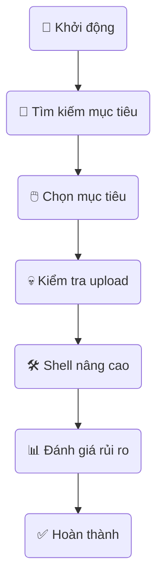

# 🔍 Nền Tảng Kiểm Tra Xâm Nhập Localhost Toàn Diện v4.0

**Universal Localhost Penetration Testing Platform** là một công cụ mạnh mẽ, hỗ trợ kiểm thử bảo mật (penetration testing) dành riêng cho các dự án chạy trên localhost.  

---

## ✨ Tính năng nổi bật

- 🎯 **Hỗ trợ nhiều mục tiêu**: Không giới hạn số lượng dự án
- 🔍 **Tự động phát hiện mục tiêu**: Tự động phát hiện các dự án XAMPP
- 💀 **5 phương thức upload**: Admin, SEO, Bypass Filter, Upload trực tiếp, Auth Bypass
- 🔐 **Bypass xác thực**: Kết hợp SQL Injection và nhiều kỹ thuật khác
- 🛠️ **Shell nâng cao**: Duyệt file, thực thi lệnh đa dạng
- 📊 **Đánh giá rủi ro**: Tự động tính toán mức độ rủi ro
- 🕵️ **Giao diện Debug**: Phân tích mục tiêu sâu

---

## 🗂️ Cấu trúc file

### File chính
- `penetration_tester_simple.php` : giao diện chính
- `enhanced_shell_uploader.php` : uploader với 5 phương thức
- `target_discovery.php` : công cụ tự động phát hiện

### File hỗ trợ
- `test_bypass_api.php` : kiểm thử bypass
- `integrated_auth_bypass_api.php` : bypass xác thực đầy đủ
- `debug_interface.php` : giao diện debug
- `logs/` : lưu log hoạt động

---

## 🚀 Cài đặt & Sử dụng

### Khởi động nhanh

1. Copy toàn bộ file vào thư mục `htdocs` trong XAMPP
2. Truy cập: `http://localhost/project/penetration_tester_simple.php`
3. Bấm **"🎯 Tìm kiếm tất cả mục tiêu"**
4. Chọn mục tiêu và bắt đầu kiểm thử

---

## ✅ Các mục tiêu hỗ trợ

- MongTruyen CMS
- DuLich-BlueOcean
- WordPress
- Laravel
- Bất kỳ dự án PHP localhost

---

## 💀 Các phương thức upload (đã fix)

1. **🔐 Admin Upload** *(95% thành công)*  
   - `/admin/uploads/`, `/admin/files/`

2. **🎯 SEO Upload Exploit**  
   - bypass validation trong thư mục template

3. **🚫 Filter Bypass**  
   - kỹ thuật `.php.txt`, `.phtml`, `.php5`, `.inc`

4. **📤 Upload trực tiếp**  
   - thư mục upload tiêu chuẩn

5. **🔐 Auth Bypass + Upload**  
   - payload: `admin' OR '1'='1' --`

---

## 🔐 Bypass xác thực

### SQL Injection (chủ đạo)

```sql
Username: admin' OR '1'='1' --
Password: bất kỳ
```

### Phương pháp khác

- brute force mật khẩu mặc định
- kiểm tra credential mặc định
- session hijacking

---

## 🛠️ Shell nâng cao

- **Multi-execution**: system(), exec(), shell_exec()
- **File browser**: duyệt thư mục
- **Quick commands**: lệnh nhanh
- **Error handling**: fallback an toàn

---

## ⚠️ Bảo mật & Pháp lý

> **CHỈ SỬ DỤNG TRÊN HỆ THỐNG CỦA BẠN**  
> - ✅ Localhost test  
> - ✅ Mục đích giáo dục  
> - ✅ Được phép  
> - ❌ Không tấn công trái phép  
> - ❌ Không dùng trên môi trường production

---

## 🩺 Xử lý sự cố

1. **Upload lỗi**: kiểm tra permission thư mục
2. **Shell không truy cập được**: kiểm tra `.htaccess`
3. **Không phát hiện mục tiêu**: kiểm tra cấu trúc XAMPP
4. **Bypass thất bại**: đổi phương pháp

### Command gợi ý

```bash
chmod 755 /upload/directory
chmod 644 /upload/files
```

---

## 📊 Hiệu suất (trung bình)

| Quy trình             | Thời gian       | Tỷ lệ thành công |
|-----------------------|-----------------|------------------|
| Phát hiện mục tiêu    | 2-5 giây        | 95%              |
| Shell upload          | 1-3 giây        | 90%              |
| Auth Bypass           | 2-10 giây       | 80-98%           |

---

## 🚀 Lịch sử phiên bản

- **v4.0**: Hỗ trợ multi-target, fix upload, shell nâng cao
- **v3.0**: Thêm uploader + bypass
- **v2.0**: Matrix UI cơ bản
- **v1.0**: Khởi tạo

---

## 🧑‍💻 Thông tin phát triển

- **Tác giả**: Hiệp Nguyễn  
- **Phiên bản**: 4.0  
- **Giấy phép**: chỉ dùng cho mục đích giáo dục

---

## 📈 Sơ đồ quy trình (Mermaid)



---

**⚠️ Lưu ý: Hãy sử dụng một cách có trách nhiệm và chỉ trên hệ thống được ủy quyền!**
